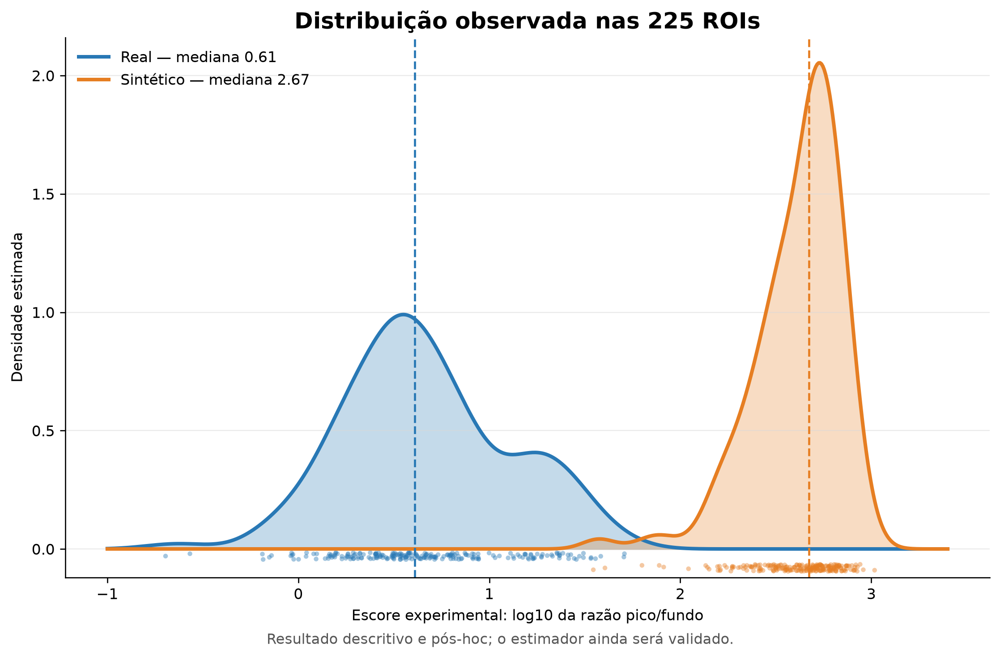
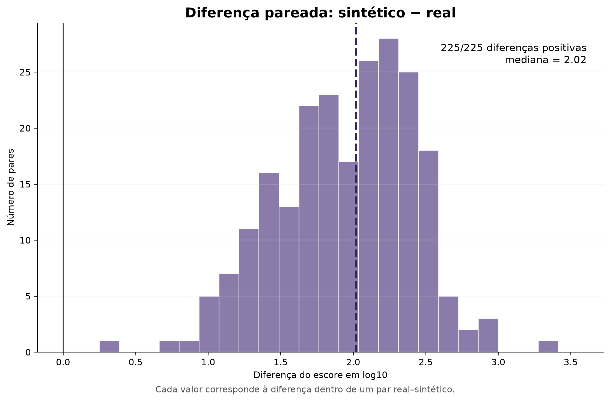
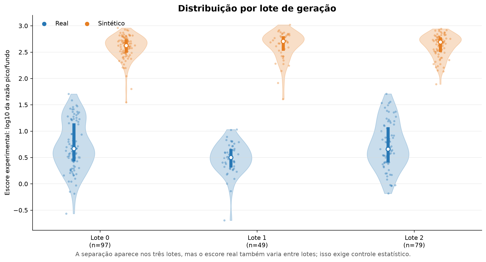

# Controle de qualidade de imagens sintéticas — relatório para reunião

**Data:** 11 de setembro de 2026  
**Projeto:** colaboração UFPB–UPenn  
**Frente atual:** validação de textura e artefatos em imagens médicas sintéticas

## 1. Mensagem central

A análise exploratória anterior encontrou uma separação quase perfeita entre
ROIs reais e sintéticas por um escore chamado `nyquist_excess`. O resultado é
forte como **observação descritiva**, mas a fórmula foi desenvolvida de modo
exploratório, com auxílio de LLMs, e ainda não foi validada como medida de uma
periodicidade de dois pixels. A literatura justifica investigar picos
espectrais, aliasing e padrões periódicos em geradores, porém não valida essa
implementação nem estabelece `nyquist_excess` como métrica padronizada.

O plano proposto é usar uma ablação em três níveis:

1. validar o próprio estimador em sinais controlados;
2. localizar em qual etapa do gerador aparece a assinatura;
3. atenuar o atributo em intensidades graduais e medir seu efeito no
   classificador downstream, sempre com teste final em pacientes reais.

## 2. Contexto e objetivo do projeto

O projeto busca avaliar imagens sintéticas destinadas a complementar dados
médicos escassos ou mal distribuídos. O objetivo do framework de controle de
qualidade não é apenas distinguir real de sintético, mas identificar falhas que
possam prejudicar anatomia, achados pequenos ou desempenho downstream.

A estratégia atual utiliza CT pulmonar como bancada metodológica e, após a
consolidação, pretende transferir o método para mamografias. Ainda não se deve
tratar qualquer métrica isolada como certificado de equivalência clínica.

## 3. EDA inicial em mamografia

### 3.1 Dados

A bancada `gen-fid` contém:

- 225 pares de ROIs reais e sintéticas;
- 202 pacientes;
- 102 ROIs de calcificação e 123 de massa;
- três lotes de geração: 97, 49 e 79 pares;
- 173 métricas na tabela de decisão consolidada.

Foram usados controles como versões bicúbicas, real com ruído e versões
passa-baixa. Esses controles são importantes porque uma métrica pode separar
real de sintético por razões irrelevantes ou triviais.

### 3.2 Problemas de comparabilidade encontrados

Antes da interpretação de textura, a EDA encontrou diferenças de representação:

- a faixa dinâmica sintética estava comprimida, aproximadamente
  `sintético ≈ 0,38 × real + 0,34`;
- o real apresentava grade de quantização de 12 bits, enquanto o sintético era
  armazenado como float contínuo;
- métricas como GLCM, gradiente, LBP, SSIM e PSNR poderiam medir escala,
  quantização ou empates, e não necessariamente textura.

Por isso, alinhamento de intensidade e requantização controlada são condições
do experimento, não detalhes opcionais.

### 3.3 Resultado das 173 métricas

| Veredito exploratório | Quantidade |
| --- | ---: |
| Cega aos desvios controlados | 82 |
| Falha em escala de tecido | 42 |
| Falha apenas em escala fina | 19 |
| Inconclusiva | 18 |
| Modelo passa naquele eixo | 8 |
| Detector de artefato de geração | 4 |

O resultado serviu para reduzir o espaço de investigação. Ele não significa que
as métricas selecionadas já sejam biomarcadores ou critérios clínicos.

## 4. Power Spectrum e GLCM

O Power Spectrum mostrou uma redistribuição de energia, e não apenas uma
mudança global de nitidez:

| Escala aproximada | Razão de potência sintético/real |
| --- | ---: |
| 512–64 px | 1,06–1,19; dentro do piso de medição observado |
| 32 px | 0,78 |
| 16 px | 1,34 |
| 8 px | 2,16 |
| 4 px | 2,47 |

A inclinação global `beta` teve AUC 0,609 e foi classificada como cega. Já a
fração espectral entre 0,25 e 0,5 ciclos/pixel teve AUC 0,824, sugerindo que as
diferenças se concentram nas escalas finas.

Na GLCM, as médias angulares em distância de um pixel apresentaram:

| Métrica | AUC real–sintético |
| --- | ---: |
| Contraste | 0,869 |
| Dissimilaridade | 0,872 |
| Homogeneidade | 0,872 |

Essas métricas continuam relevantes como complemento: o espectro descreve
energia por frequência e descarta fase; a GLCM descreve relações locais entre
níveis de intensidade. Na próxima etapa será usado apenas um painel pequeno e
pré-especificado, com quantização global fixa.

## 5. Como surgiu o `nyquist_excess`

O escore não foi escolhido previamente a partir de uma norma. Durante a
investigação de harmônicos de quatro pixels, o último bin do espectro apareceu
como responsável pela separação. Esse componente foi então isolado e recebeu o
nome `nyquist_excess`.

Na análise inicial documentada sobre um subconjunto de 75 pares, foram
reportadas medianas aproximadas de 0,67 para o real e 2,71 para o sintético,
com AUC 1,000.

Na consolidação atual dos 225 pares:

| Estatística | Real | Sintético |
| --- | ---: | ---: |
| Média | 0,667 | 2,611 |
| Desvio-padrão | 0,434 | 0,233 |
| Mediana | 0,611 | 2,673 |
| Percentil 10 | 0,174 | 2,321 |
| Percentil 90 | 1,317 | 2,845 |
| Mínimo–máximo | −0,695–1,707 | 1,545–3,017 |

A diferença pareada sintético menos real foi positiva em 225/225 pares, com
mediana de 2,018 unidades em escala log10. A AUC exploratória calculada na EDA
foi 0,9999. Há pequena sobreposição das faixas marginais, apesar de todas as
diferenças pareadas serem positivas.

Na implementação atual, o escore é `log10(potência do pico / potência de fundo)`.
Uma unidade log10 corresponde a uma razão de 10 vezes; duas unidades, a 100
vezes. Portanto, “décadas” era apenas o nome técnico dessa unidade logarítmica,
não uma referência a tempo, bits ou contraste direto entre pixels. Nos gráficos,
o eixo foi renomeado para mostrar a fórmula explicitamente.

A análise pareada mostra quanto o escore mudou dentro de cada par correspondente:

A separação também apareceu nos três lotes, embora a distribuição do real varie
entre eles. Isso reforça a necessidade de análise agrupada por paciente e de
controle para lote.

### 5.1 O que o código atual calcula

O código atualmente chamado `nyquist_excess`:

1. calcula o valor absoluto da diferença entre pixels vizinhos;
2. produz um perfil médio horizontal e vertical;
3. aplica janela e FFT unidimensional a esses perfis;
4. compara o máximo dos últimos bins com a mediana do restante do espectro;
5. retorna o maior valor entre as duas direções em escala logarítmica decimal.

Essa descrição informa o que o programa faz, mas **não demonstra que o valor é
uma medida válida de Nyquist ou de checkerboard**.

### 5.2 Problemas ainda em aberto

- O valor absoluto do gradiente é uma transformação não linear e descarta o
  sinal da alternância.
- A operação de diferença reduz um eixo de 256 para 255 amostras; assim, o
  último bin não coincide exatamente com 0,5 ciclos/pixel.
- Comparar os bins finais com a mediana de quase todo o espectro pode confundir
  um pico estreito com excesso amplo de alta frequência.
- O máximo entre os eixos perde informação direcional.
- Bordas da ROI, máscaras, janela, quantização e redimensionamento podem alterar
  o resultado.
- A separação foi descoberta no próprio conjunto usado para caracterizá-la;
  portanto, AUC alta não constitui validação externa.

Até a auditoria, o nome mais prudente é **escore experimental de periodicidade
de dois pixels** ou **energia próxima a Nyquist**.

## 6. O que a literatura sustenta

- A frequência de Nyquist é o limite de representação de uma grade amostrada;
  em um eixo de imagem, 0,5 ciclos/pixel corresponde a uma alternância de
  período de dois pixels.
- Odena, Dumoulin e Olah mostram que operações de upsampling podem gerar
  checkerboards de frequências relacionadas ao stride e à sobreposição.
- Karras et al. mostram que filtragem e upsampling inadequados podem deixar
  referências às posições pares e ímpares da grade por aliasing.
- Corvi et al. mostram picos espectrais e autocorrelações periódicas em imagens
  de difusão latente, relacionados ao fator de upsampling do latente para os
  pixels.

Esses trabalhos justificam investigar o fenômeno, mas nenhum deles valida a
fórmula local nem estabelece uma métrica clínica chamada `nyquist_excess`.

Referências principais:

1. [Corvi et al. — Intriguing Properties of Synthetic Images: From GANs to Diffusion Models, 2023](https://openaccess.thecvf.com/content/CVPR2023W/WMF/html/Corvi_Intriguing_Properties_of_Synthetic_Images_From_Generative_Adversarial_Networks_to_CVPRW_2023_paper.html)
2. [Odena, Dumoulin e Olah — Deconvolution and Checkerboard Artifacts, 2016](https://distill.pub/2016/deconv-checkerboard/)
3. [Karras et al. — Alias-Free Generative Adversarial Networks, 2021](https://proceedings.neurips.cc/paper/2021/hash/076ccd93ad68be51f23707988e934906-Abstract.html)
4. [Traverso et al. — Repeatability and Reproducibility of Radiomic Features, 2018](https://pubmed.ncbi.nlm.nih.gov/30170872/)

## 7. Migração para a bancada pulmonar

O conjunto pulmonar disponível contém 100 pares real/sintético e 100 máscaras,
mas representa apenas três pacientes. Os TIFFs são float e não preservam
metadados DICOM nem unidades HU; portanto, as métricas atuais descrevem a escala
fornecida, não uma validação física de CT.

Resultados preliminares já existentes:

| Métrica | Real | Gerado |
| --- | ---: | ---: |
| SNR | 17,53 | 25,09 |
| CNR | 13,71 | 19,68 |
| NPS | 0,000751 | 0,000114 |
| Variância do Laplaciano | 0,604 | 0,412 |
| Tenengrad | 0,864 | 0,559 |

As métricas pareadas reportadas foram PSNR 24,53, MAE 0,1069, MS-SSIM 0,7136 e
SSIM 0,6814. Esses resultados sugerem mudança de ruído/nitidez, mas não isolam
tecido, artefato do gerador ou preservação clínica.

## 8. Proveniência recuperada do gerador pulmonar

Foi recuperado e verificado o peso do AEKL:

- arquivo: `model_aekl_best_4_latent_new_lung.pth`;
- tamanho: 25,16 MiB;
- SHA-256: `F9CF5EC7E4A9E8478005B25B1495612C5CAA1D53D831864FD8AFFD7E34F550C4`.

A run original do DGen foi identificada como
`run-20250717_204422-tiktjfcd`:

- duração aproximada: 14 h 21 min;
- 10 épocas;
- fator de escala latente calculado: 1,0201434;
- melhor perda de validação: 0,111207, na época 5;
- perda final: 0,122411.

A configuração registrada indica quatro canais latentes e um canal adicional,
entrada total de cinco canais, dois embeddings de classe e condicionamento por
cross-attention. Alterações posteriores no código acrescentaram mapas RGB e não
devem ser confundidas com a execução original. O commit registrado pelo W&B
não contém necessariamente todas as alterações locais executadas naquela run.

## 9. Plano de validação por ablação

### Etapa A — validar o estimador

Construiremos sinais nos quais a resposta esperada é conhecida:

- alternância horizontal de dois pixels;
- alternância vertical;
- checkerboard;
- grades de quatro e oito pixels;
- ruído branco e ruído correlacionado;
- suavização;
- diferentes profundidades de bits e passos de quantização;
- bordas e tamanhos de ROI variados.

O estimador atual será comparado a medidas independentes:

- FFT 2D diretamente na imagem;
- potência nos pontos e vizinhanças próximos a Nyquist;
- contraste entre posições pares e ímpares;
- correlação com `(-1)^x`, `(-1)^y` e `(-1)^(x+y)`;
- autocorrelação nos lags 1 e 2;
- pico relativo a um fundo espectral local.

Critérios mínimos para aceitar uma medida:

1. especificidade para o padrão pretendido;
2. resposta monotônica à amplitude conhecida;
3. estabilidade a offset e escala de intensidade;
4. comportamento conhecido diante de quantização, ruído e blur;
5. concordância com pelo menos uma medida independente.

### Etapa B — localizar a origem no modelo

Usaremos as mesmas imagens e regiões em três condições:

1. imagem real;
2. imagem real codificada e reconstruída pelo AEKL;
3. imagem gerada pelo DGen.

Interpretação:

| Resultado | Hipótese favorecida |
| --- | --- |
| Real ≈ AEKL; DGen diferente | Difusão/amostragem ou condicionamento |
| AEKL já diferente do real | Autoencoder/decodificador participa da origem |
| AEKL intermediário; DGen mais forte | AEKL introduz e a difusão amplifica |
| Diferença desaparece com estimador corrigido | Achado anterior era dependente da métrica |

Power Spectrum será a análise central. Um painel pequeno de GLCM em distância de
um pixel será complementar, para verificar mudanças de textura local além da
assinatura periódica.

### Etapa C — testar relevância downstream

Serão criadas versões pareadas das mesmas imagens sintéticas:

- original;
- atenuação leve;
- atenuação média;
- atenuação forte;
- controle placebo com processamento semelhante, sem remover especificamente o
  padrão-alvo.

Primeiro, um classificador fixo receberá as versões pareadas para medir mudanças
em probabilidades, decisões e representações internas. Depois, modelos serão
treinados com:

1. apenas reais;
2. reais + sintéticas originais;
3. reais + sintéticas em cada intensidade de atenuação;
4. futuramente, reais + imagens de um gerador arquiteturalmente modificado.

Todos os braços deverão manter número de imagens, distribuição de classes,
hiperparâmetros e splits por paciente. A avaliação final será exclusivamente em
pacientes reais independentes e deverá usar várias sementes.

Uma relação dose–resposta — menor assinatura acompanhada de melhor desempenho
em dados reais — constituiria evidência mais forte de relevância. Ausência de
efeito indicaria um artefato técnico possivelmente irrelevante ao classificador.
Piora após filtragem poderia significar remoção simultânea de detalhes úteis.

## 10. Entrega proposta e limites

### Entrega imediata

- auditoria do estimador em sinais controlados;
- distribuições real, AEKL e DGen;
- espectro 2D, perfil radial e autocorrelação;
- painel reduzido de GLCM;
- conclusão provisória sobre a etapa de origem;
- protocolo fechado para o experimento downstream.

### Limites que precisam constar na reunião

- `nyquist_excess` ainda não está validado;
- a análise inicial foi pós-hoc;
- separação real–sintético não implica prejuízo clínico;
- remover um pico não garante preservação anatômica;
- o conjunto pulmonar possui apenas três pacientes;
- alterar o LDM muda várias propriedades simultaneamente e dificulta atribuição
  causal; por isso, a intervenção pareada vem antes do retreinamento.

## 11. Roteiro oral curto

> A EDA ampla encontrou várias diferenças entre real e sintético, mas uma delas
> chamou atenção: o estimador atual separou quase perfeitamente as distribuições
> e apresentou valor maior no sintético em todos os 225 pares. Essa assinatura
> foi chamada de excesso de Nyquist porque aparece no extremo de alta frequência
> e é compatível com periodicidade curta. Entretanto, ela surgiu de uma análise
> exploratória e a fórmula ainda não foi validada. A literatura mostra que
> geradores e modelos de difusão latente podem produzir picos espectrais ligados
> ao upsampling, mas não valida nosso escore. Por isso, o próximo passo é uma
> ablação: primeiro validamos a métrica com sinais conhecidos; depois comparamos
> real, reconstrução AEKL e DGen para localizar a origem; por fim atenuamos o
> atributo em níveis controlados e testamos seu efeito no classificador usando
> pacientes reais independentes. Assim, conectamos uma observação de controle de
> qualidade à utilidade downstream sem assumir causalidade antes do experimento.
